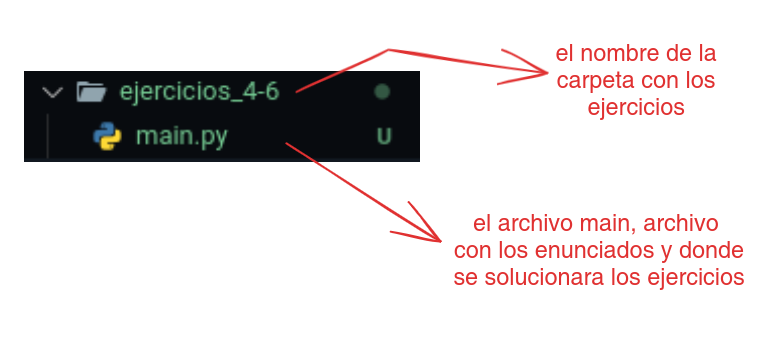
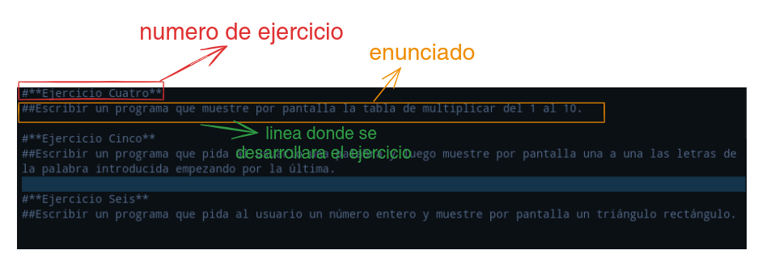

# ejercicios_python

los ejercicios python son ejercicios basicos de programacion con `python` que reforzara lo aprendido en clases.

### los ejercicios estan ordenados de la siguiente manera:

- los ejercicios se encuentran en una carpeta cuyo nombre tiene los numeros de lso ejercicios
- cada carpeta tiene un archivo main donde estaran los enunciados y donde se tendra que solucionar los ejercicios
  
  
  ### el archivo `main` esta ordenado de la siguiente manera
- cada archivo `main` tendra tres ejercicios cada ejercicio comentado entre `#`.
- cada ejercicios tendra su numero de ejercicios y el enunciado, a continuacion la linea de codigo vacia donde se desarrollara la solucion del ejercicio
  

> [!TIP]
> **Recomendacion:** para que este repositorio aparesca en su repositorio personal y comiencen a trabajar sobre el deberan hacer un `fork` a este repositorio.

Video con la explicacion

[como hacer fork de los ejercicios python - YouTube](https://youtu.be/EmtPJQfeNvg)
